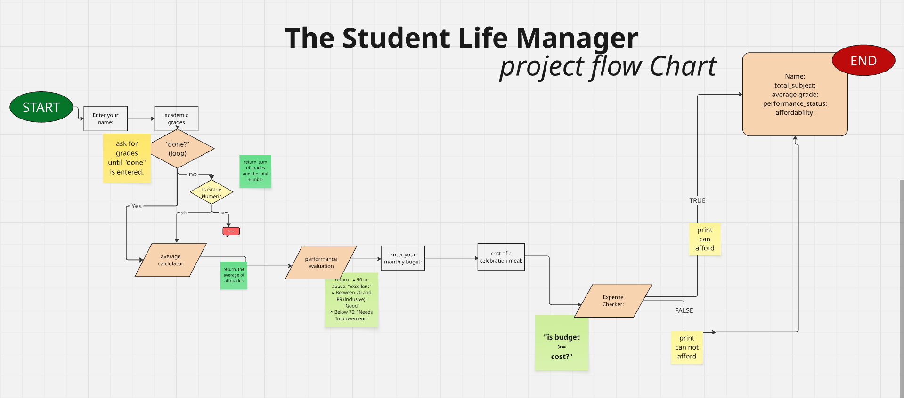

# 🎓 Student Life Manager

[](https://www.python.org/) 
[](LICENSE)  

---

## 📌 Project Overview
**Student Life Manager** is a **command-line Python application** designed to help students track their academic performance and evaluate financial feasibility for celebration expenses.  

Built with **clean, modular code**, it emphasizes proper data flow through **function parameters and return values** without using global variables, ensuring maintainability and scalability.  

---

## 🧠 Key Features
- Accepts an **unlimited number of grades**  
- **Calculates and rounds the average grade**  
- **Evaluates academic performance** based on thresholds  
- **Checks affordability** of celebration expenses  
- Generates a **formatted summary report**  

---

## 🧩 Program Structure
| Function | Description |
|----------|-------------|
| `user_grades()` | Collects grades and returns total and count |
| `average_calculator(total, count)` | Computes the rounded average |
| `performance_evaluation(average)` | Determines academic status (Excellent, Good, etc.) |
| `expense_checker(budget, expense)` | Checks affordability of a celebration expense |
| `controller()` | Coordinates program execution |

> **Design Principle:** All data flows through function arguments and return values. No global state is used.

---

## 🔄 Program Flow


---

## ▶️ Getting Started

### Prerequisites  
- Terminal or command prompt  

### Installation
1. Clone the repository:  
   ```bash
   git clone https://github.com/REDRAGO14/The_Student_Life_Manager.git
2. Navigate into the directory:
    ```bash
    cd student-life-manager
3. Run the application:
    ```bash
    python main.py
